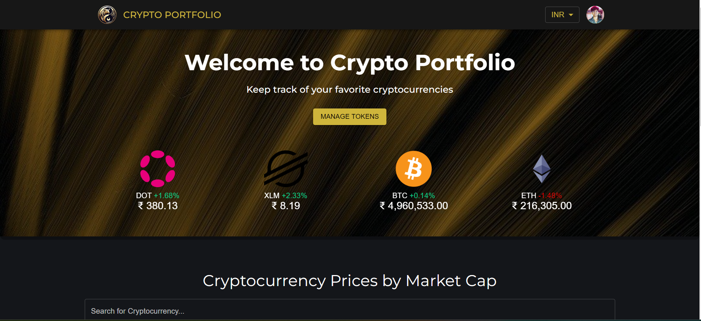
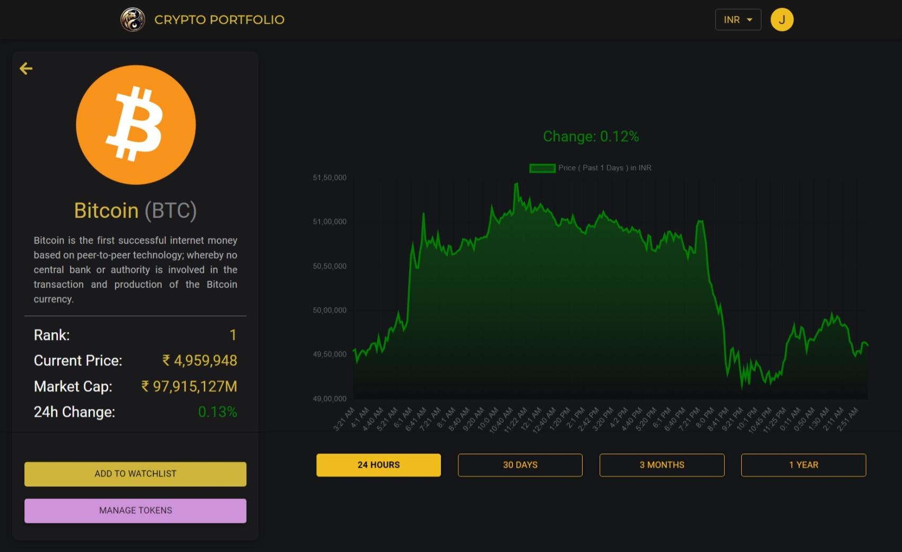
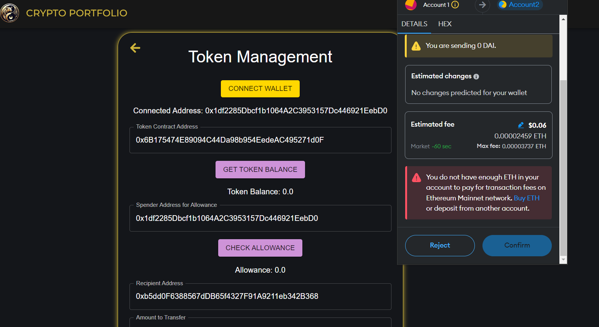
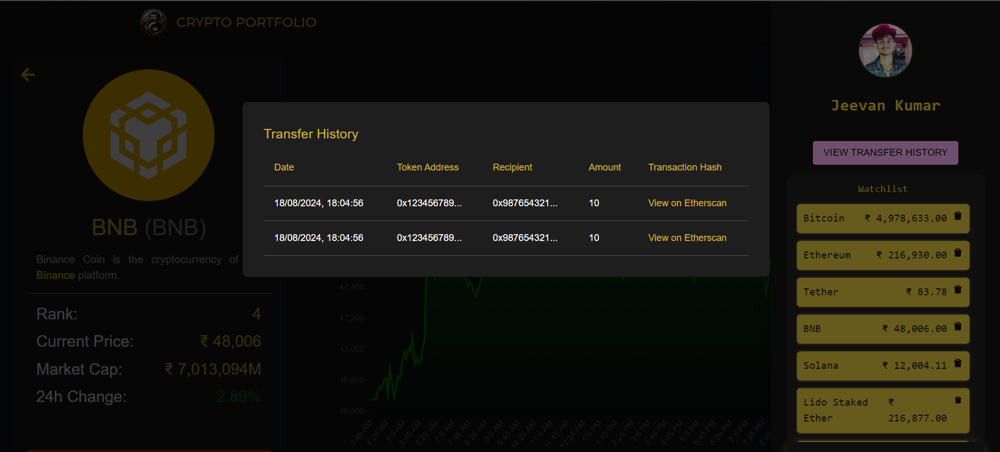

#  <span style="color:gold;">Crypto-Portfolio-App               </span>                                                                                                                                                                                                                                                                                          
                              


------------------------------------------------------------
________________________________________________________________

---
**Live Link**

Explore the live version of the Crypto-Portfolio App here: [Live Link](https://cryptoportfolio.vercel.app/)

---

<p align="center" style="background-color:black; padding: 10px; ">
  
</p>

---

##  **<span style="color:gold;">Overview</span>**

Welcome to **<span style="color:gold;">Crypto-Portfolio App</span>** — your ultimate solution for managing, tracking, and transferring cryptocurrency assets with ease. Whether you're a seasoned crypto enthusiast or just getting started, our app provides an intuitive and feature-rich platform to keep your investments on track.

###  **<span style="color:gold;">Key Features</span>**

- **Wallet Connection:** Securely connect your Metamask wallet address.
- **Watchlist Management:** Keep an eye on your favourite tokens with real-time balance updates.
- **Historical Data:** Access and visualize historical balances with our interactive chart and date picker.
- **Allowance Checks:** Quickly verify token allowances for various intelligent contracts.
- **Token Transfer:** Effortlessly transfer tokens to any address with a few clicks.

---

##**<span style="color:gold;">Visual Experience</span>**


###  **<span style="color:gold;">Historical Balance Chart</span>**

<p align="center" style="background-color:black; padding: 10px;">
  
</p>

###  **<span style="color:gold;">Token Transfer Form</span>**

<p align="center" style="background-color:black; padding: 10px;">
  
</p>

###  **<span style="color:gold;">User Side Bar & Transaction history</span>**

<p align="center" style="background-color:black; padding: 10px;">
  
</p>

---

## 📹 **<span style="color:gold;">Video Demo</span>**

Get a live feel of the Crypto-Portfolio App in action! Watch the demo:

<p align="center" style="background-color:black; padding: 10px;">
  <a href="https://youtu.be/xOmcwdAj4Mo" target="_blank" style="color:gold;">
    
  </a>
</p>


---

## 🛠 **<span style="color:gold;">Tech Stack</span>**

The app is powered by the latest technologies, ensuring performance, scalability, and a top-notch user experience:

- **Frontend:** [React.js](https://reactjs.org/), [Material-UI](https://mui.com/) , [Chart Js](https://www.npmjs.com/package/react-chartjs-2)
- **Blockchain Interaction:** [Web3.js](https://web3js.readthedocs.io/), [Ethers.js](https://docs.ethers.io/)
- **Backend:** [Firebase](https://firebase.google.com/) for authentication and data management
- **Deployment:**  [Vercel](https://vercel.com/)

---

## 🚀 **<span style="color:gold;">Getting Started</span>**

Follow these steps to set up the Crypto-Portfolio App locally:

### 1. **Clone the Repository:**

```bash
git clone https://github.com/your-username/crypto-portfolio-app.git
cd crypto-portfolio-app
```

## 2. Install Dependencies:
```bash
npm install
```

## 3. Configure Environment Variables:
Create a .env file in the root directory and add your environment variables (e.g. API keys)


## 4. Run the App:
```bash
npm start
```


---

🧩 **Code Structure**

Our app is designed with a modular architecture, ensuring maintainability and scalability. Here’s a quick overview of the key components:


- **CryptoContext.js**: Manages global state, blockchain interactions, and Firebase operations. This includes handling user data, token history, and real-time updates.
- **Header.js**: A consistent navigation bar with currency selection. Features include logo navigation, currency dropdown, and authentication options.
- **CoinTable.js**: A dynamic table for cryptocurrencies with search, sort, and pagination. Provides an interactive interface to view and filter cryptocurrency data.
- **SelectButton.js**: A customizable, reusable button component for various UI elements like selecting tokens or other options.
- **UserSidebar.js**: Displays user-specific information and options when logged in. Includes features like account details and settings.
- **Token.js**: Handles token-specific functionalities such as viewing details, transfer operations, and allowance checks.
- **CoinsPage.js**: A page that presents detailed information about selected cryptocurrencies, including historical data and current market stats.
- **Banner.js**: Contains the app's main visual elements and promotional content, such as featured tokens or market news.
- **AuthModal.js**: Provides a modal interface for user authentication and registration.
- **Homepage.js**: The landing page of the app, featuring an overview of the key functionalities and a navigation to other sections.
- **TokenPage.js**: Dedicated page for managing individual tokens, including balance viewing, transaction history, and transfer functionalities.
- **SelectButton.js**: A reusable button component used for selecting tokens or other options, with a customizable style to indicate selection.

---

🎯 **Contribution Guidelines**

We welcome contributions from developers worldwide! Here’s how you can get involved:

1. Fork the repository.
2. Create a new branch for your feature or bug fix.
3. Submit a pull request with a detailed description of your changes.

---


